# Self-hosted AI with LM Studio <!-- omit in toc -->


## Contents <!-- omit in toc -->
- [Intro](#intro)
- [Hardware](#hardware)
- [Setup LM Studio](#setup-lm-studio)
  - [GUI](#gui)
    - [Install](#install)
    - [Get models](#get-models)
    - [Load models](#load-models)
    - [Developer (ps model)](#developer-ps-model)
    - [Server](#server)
    - [Chat](#chat)
    - [Help](#help)
  - [CLI](#cli)
    - [Install](#install-1)
    - [Start daemon](#start-daemon)
    - [Get models](#get-models-1)
    - [Load models](#load-models-1)
    - [ps model](#ps-model)
    - [Server](#server-1)
    - [Working snippet](#working-snippet)
    - [Chat](#chat-1)
    - [Help](#help-1)
- [WSL (firewall, ssh and mirroring)](#wsl-firewall-ssh-and-mirroring)
- [VS Code](#vs-code)
- [Python](#python)
  - [Install SDK](#install-sdk)
  - [Simple hello world](#simple-hello-world)
  - [Web application (spell checker)](#web-application-spell-checker)
  - [devcontainer](#devcontainer)
- [Bash (REST API)](#bash-rest-api)
- [Energy consumption (cost)](#energy-consumption-cost)

## Intro

With many of the big AI providers changing their payment model, developers (and companies) face a substantial budget increase if they want to keep prompting with copilot.

A way to mitigate this budget increase is by hosting your own AI models. A side effect is that you are more in control of the production environment. Now it is you who decide when you shift to a new model. And if you integrate AI tools into your products you are in control of your supply chain.

So in a nutshell self-hosting gives:

* Reduced price / preditable budgets (only cost is hardware + electricity)
* Control over AI models
* Control over supply chain

In this guide we will use [LM Studio](https://lmstudio.ai/) to setup our AI models as it is free for home and work use - and it works both for Windows, Mac and Linux. 

We will cover:

* Setup LM Studio
  * Via GUI
  * Via CLI
* Integration into VS Code
* Chat integration into a Python application (using LM Studio's Python SDK)
* Chat integration into a bash terminal (via LM Studio's REST API and curl)

## Hardware

The hardware setup used in this guide is very sparse. But even with the minimal resources we are able to do real work (as we will see later in the guide).

Out setup:

* **CPU:** AMD Ryzen 9 (12 core)
* **RAM:** 32GB DDR5
* **GPU:** NVIDIA GeForce RTX 5060 Ti (8GB VRAM)

## Setup LM Studio

### GUI

#### Install

Go to [LM Studio](https://lmstudio.ai/) and download the latest installer for your system. In our case we use Windows: https://lmstudio.ai/download/latest/win32/x64

#### Get models

When LM Studio opens go to the "Model Search"

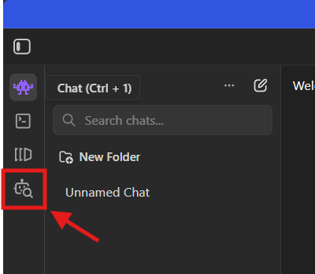

You are now presented with a Marketplace of both trusted providers (like Google, Qwen etc.) and community versions of open sourced models.

The new models from Google (like Gemma 4) are really interesting. Especially because they are free and open-source. And almost daily a new model is released with higher tokens per second with a similar (or lower) VRAM footprint.

Here we:

* Search "gemma 4"
* Pick "**Gemma 4 E4B**" (as it represents a sweet spot for an 8GB VRAM GPU, providing both decent tokens per second and sufficient context size)
* Click "Download"

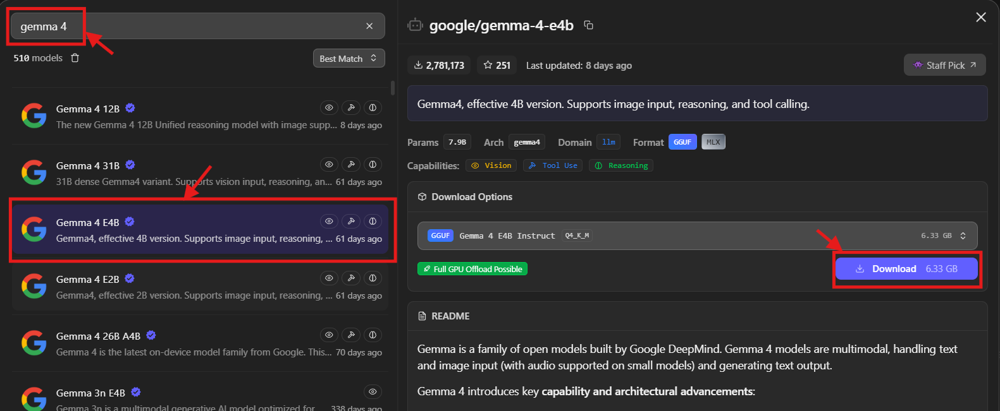

Wait until the download is complete

#### Load models

Now we can load the model:

* Go to "My Models" section
* Click "Load Model"
* Adjust the settings:
  * The main focus is to have as much GPU Offloading without exceeding our available VRAM (offloading to CPU is bad/slow)
  * **Context Length:** 60000 tokens (gives usable input contexts, especially in VS Code that can be context heavy)
  * **GPU Offload:** 34 (is the single most important parameter to get as high tokens per sec value)
  * **CPU Tread Pool Size:** 12 (in the event we need CPU to offload the GPU... but is generally better to stay inside the VRAM constraint)
  * **Physical Batch Size:** 1024 (can give a small boost on tokens per sec, and was just to use all VRAM)
  * Remember to click "Remember settings for ..."
  * Finalize by clicking "Load Model"

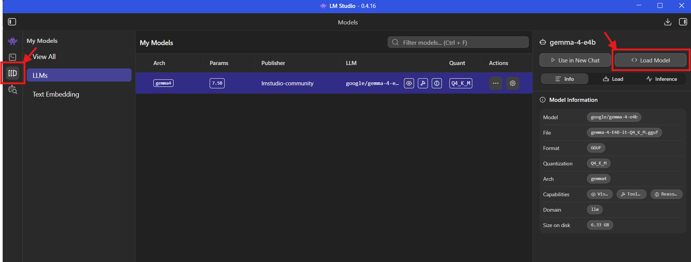

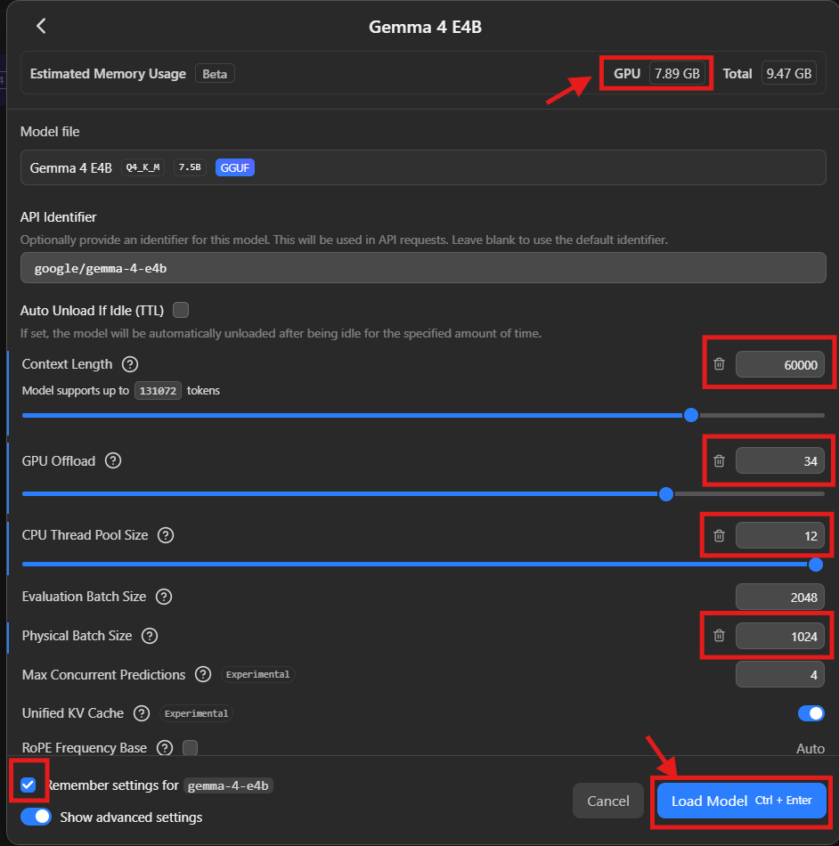

#### Developer (ps model)

Now we:

* Go to the "Developer" section
* First we can see "Gemma 4 E4B" is loaded
* Important info is shown in the "API Usage". This is needed for VS Code, Python SDK and REST API integration later on.

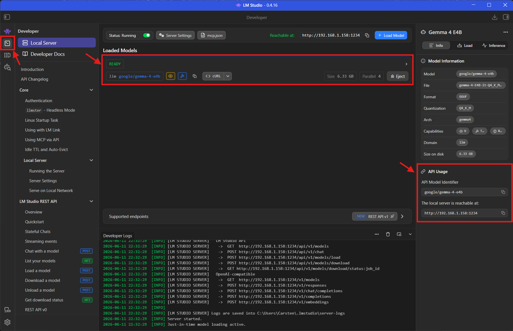

#### Server

It is important that the server is not only binding to localhost if the model should be accessible from other machines:

* Status: Running (make sure to enable the server)
* Click "Server Settings"
* Enable "Server on Local Network"

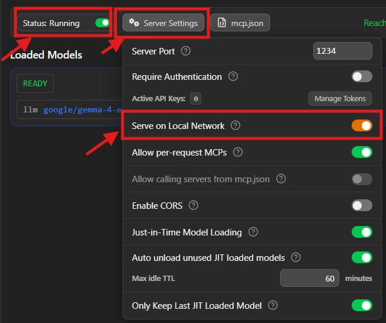

#### Chat

First we select the model used in the chat:

* Go to the "Chat" section
* Click "Select a model to load"
* Click "google/gemma-4-e4b"

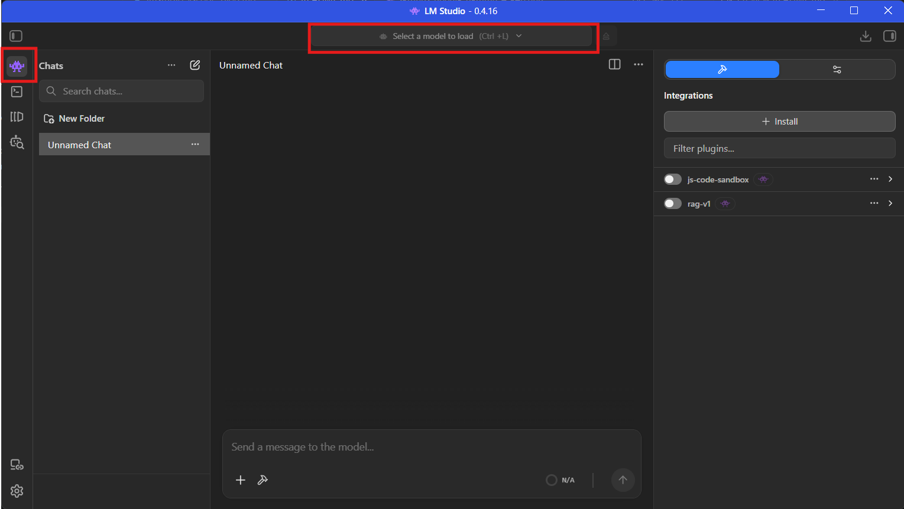

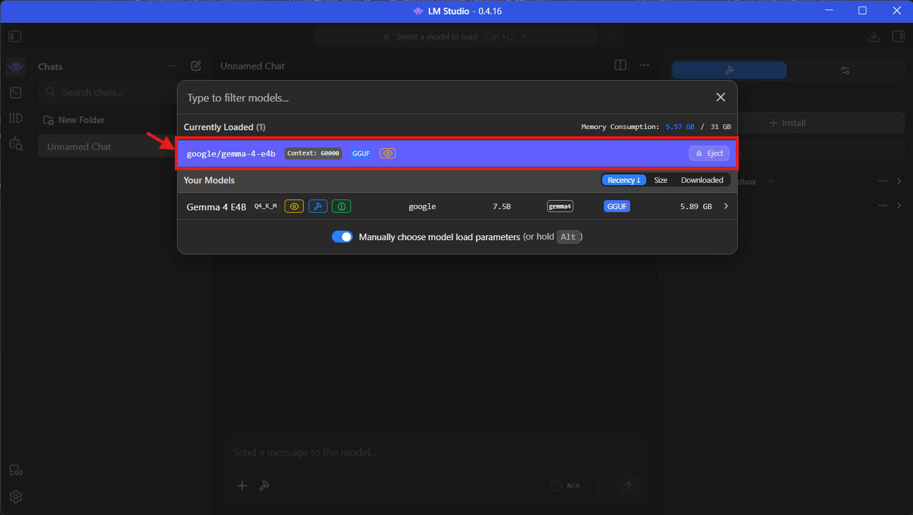

Finally we can chat and ask the model to create a small "Hello World" python application.

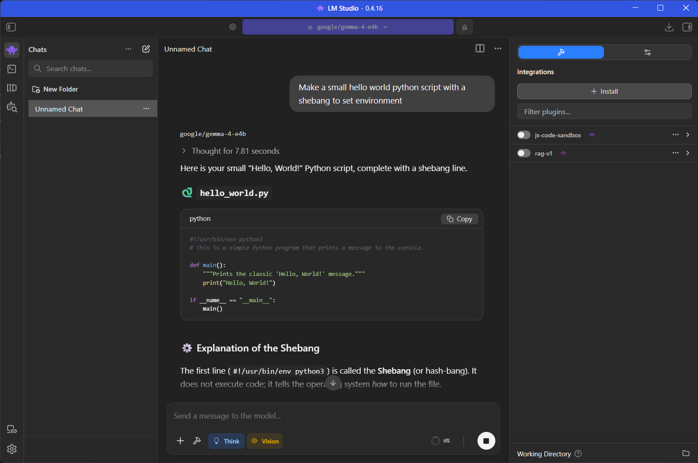

#### Help

Detailed GUI documentation can be found here: https://lmstudio.ai/docs/app/basics

### CLI

An alternative to the GUI based solution is to run LM Studio completely from terminal. This is called headless mode and is especially useful if your AI Models are running on remote servers and/or if you want to automate your deployment via scripts.

From personal preference Linux is selected for the headless installation. Since the hardware is running on a Windows PC, we go with [Windows Subsystem for Linux](https://learn.microsoft.com/en-us/windows/wsl/) (WSL). However everything that is written in this section will apply to (almost) all other Linux distros.

#### Install

To install make sure to have `curl` installed and run

    curl -fsSL https://lmstudio.ai/install.sh | bash

LM Studio is installed to

    ~/.lmstudio

LM Studio is controlled via the `lms` command.

LM Studio will normally automatically add `~/.lmstudio/bin` to your `PATH` to make `lms` command available. If this is not the case, you can always add it manually to `~/.bashrc`.

    # in ~/.bashrc
    export PATH="$HOME/.lmstudio/bin:$PATH"

#### Start daemon

Now we are ready to start LM Studio in headless mode

    lms daemon up

This will print

    Waking up LM Studio service...
    llmster started (PID: 836).

> **NOTE!** If you load a model without a started `daemon` lms with automatically start the `daemon` for you.

#### Get models

A list of all available models is found here: https://lmstudio.ai/models

To download `google/gemma-4-e4b` we do 

    lms get -y google/gemma-4-e4b

You can delete a model again by simply removing it from the `model` folder. Fx to remove `google/gemma-4-e4b` do

    rm -rf ~/.lmstudio/models/lmstudio-community/gemma-4-E4B-it-GGUF

#### Load models

To load a model you do

    lms load google/gemma-4-e4b

There are a number of configs that can be applied when loading a model.

Below are a small sample of configs (arguments) that can be used when loading the model to change settings, similar to what we did in the "[My Models](#load-models)" section of the GUI.

Most important are the `--context-length` and `--gpu` options.

    # identifier
    lms load <model_key> --identifier "my-custom-identifier"

    # context length
    lms load <model_key> --context-length 4096

    # gpu offload
    lms load <model_key> --gpu 0.5    # Offload 50% of layers to GPU
    lms load <model_key> --gpu max    # Offload all layers to GPU
    lms load <model_key> --gpu off    # Disable GPU offloading

    # ttl (time to live)
    lms load <model_key> --ttl 3600   # Unload after 1 hour of inactivity

A nice options is the `--estimate-only` when running load. This will not load the model itself, but give an estimate on the VRAM usage with current applied configs.

    lms load --estimate-only <model_key>

    # to estimate VRAM usage with 60000 tokens and max gpu offload
    lms load --estimate-only --context-length 60000 --gpu max <model_key>

To remove a loaded model from memory use unload

    lms unload <model_key>

#### ps model

If we want to check what models are loaded and their status use the `ps` command

    lms ps

You can list to json format for each parsing

    lms ps --json

#### Server

Similar to the GUI we need to publish the loaded models before they can be used by clients. For this we have the `server` command

    lms server start --bind 0.0.0.0 --port 1234

#### Working snippet

To make a similar setup in our headless CLI setup, to what we did in the GUI, the following 2 lines will do the job

    lms load google/gemma-4-e4b --gpu 0.75 --context-length 60000
    lms server start --bind 0.0.0.0 --port 1234

#### Chat

At this point we are ready to use the model, and can initiate chat prompt via the `lms chat <model_key>` command

    lms chat google/gemma-4-e4b

Or if you just want to execute a single prompt and exit

    lms chat google/gemma-4-e4b -p "what is 8*8"

... reply is

    64

#### Help

To get help do

    lms --help

And to get detailed command help do

    lms <command> --help

    # fx
    lms chat --help


Detailed CLI documentation can be found here: https://lmstudio.ai/docs/cli

## WSL (firewall, ssh and mirroring)

Make sure to have the LM Studio server ports open in your firewall.

On Windows LM Studio allows communication from all inbound ports to `lm studio.exe` as shown below. So a pure Windows-based LM Studio seems to work out of the box on any ports. This is different if we run it in WSL. Here we need to create an explicit rule which we call `lmstudio (wsl)`.

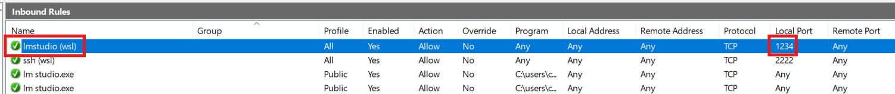

Another aspect is that if we run in WSL on a remote server we could connect via SSH. Setting up SSH on WSL is almost as straight forward as on a real linux server.

The following guide is really good on how to setup SSH on WSL: https://gist.github.com/ndraiman/34a10eff52407d67354eec65fd20d414

A key aspect from the guide is WSL mirrored networking. This feature is important if you host LM Studio from WSL, and want the server to be accessible from your lan network. Mirroring basically assigns the same IP address of your host to your WSL network, and makes it possible to redirect incoming requests to your host IP into WSL.

## VS Code

Connecting your self-hosted models into Visual Studio Code is easy, and you are not required to log into Github first.

1. Start by opening the "Toggle chat" windows and select "Manage Language Models"

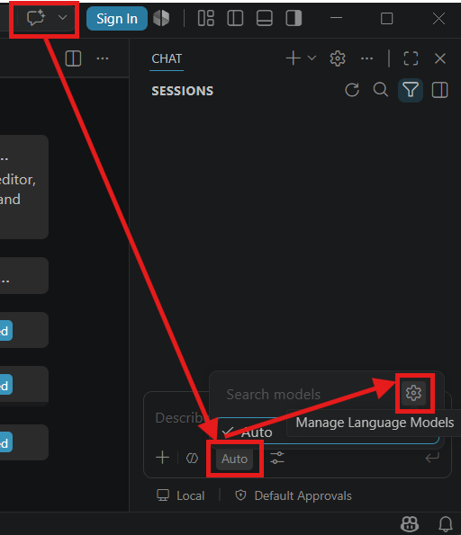

2. Next you are presented with a "Language Models" window. Here you click "Add Models...".

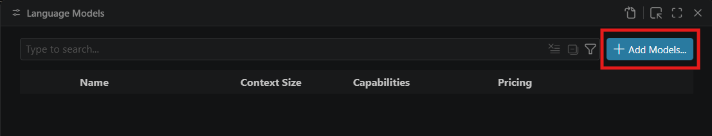

3. Then click "Custom Endpoint"

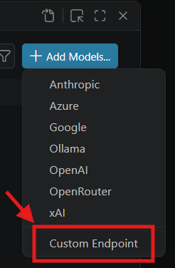

4. Now type a "Group Name" for your models. This is good if you have more self-hosted models you want to connect to, and you want to filter them. Fx if the models are located on different hardware or locations. For this guide we call it "My Custom Models".

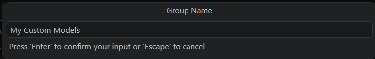

5. Next keep the "API Key" window empty and press Enter

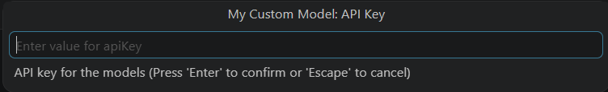

6. Select "Chat Completions" in the "API Type" window

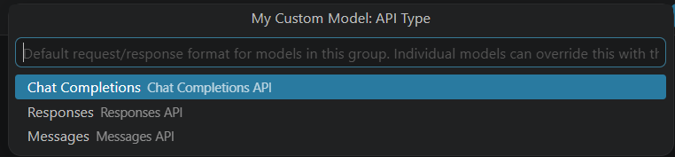

7. You are now presented with the `chatLanguageModels.json`. Here you set:
   * `id` = `google/gemma-4-e4b`
   * `name` = `google/gemma-4-e4b` (can be anything)
   * `url` = Server IP and Port
   * `maxInputTokens` = `60000` (config from GUI or CLI setup)

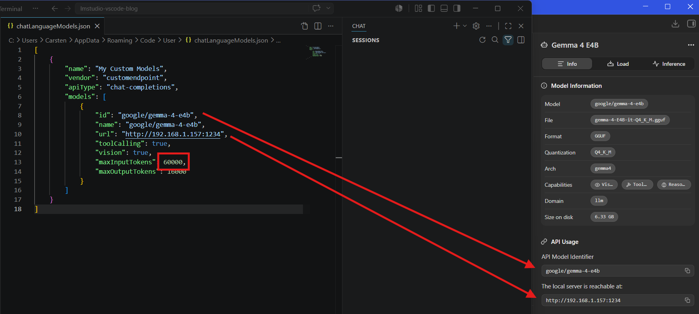

Final `chatLanguageModels.json` layout:

```json
[
	{
		"name": "My Custom Models",
		"vendor": "customendpoint",
		"apiType": "chat-completions",
		"models": [
			{
				"id": "google/gemma-4-e4b",
				"name": "google/gemma-4-e4b",
				"url": "http://192.168.1.157:1234",
				"toolCalling": true,
				"vision": true,
				"maxInputTokens": 60000,
				"maxOutputTokens": 16000
			}
		]
	}
]
```

8. Now you can pick `google/gemma-4-e4b` (is the `name` property from above)

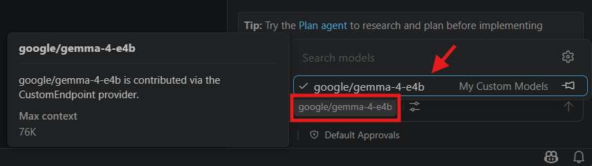

9. Finally you can type a prompt and see your self-hosted model doing actual work in VS Code.

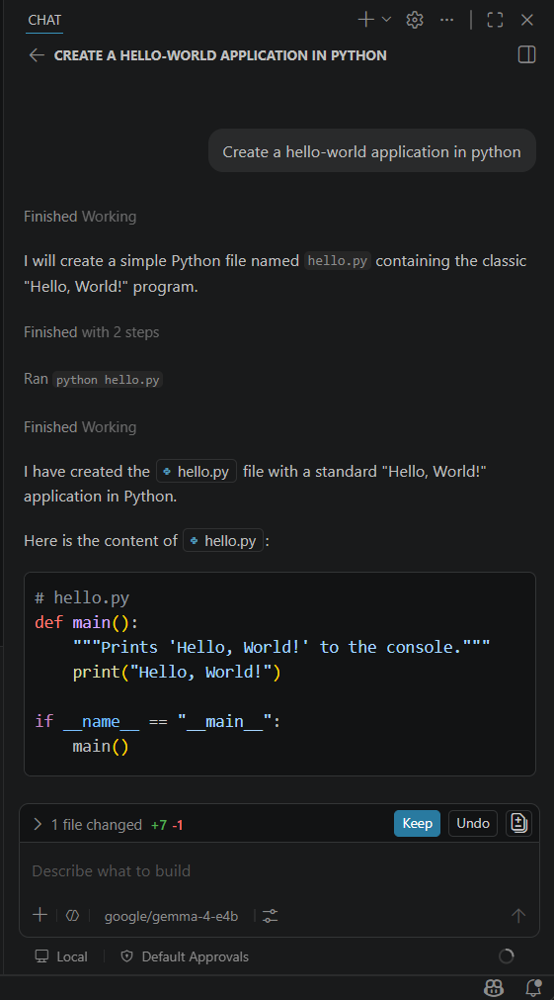

> **NOTE!** Getting the `id` and `url` information in a CLI setup is a matter of issuing the following commands
>
>```bash
># model key (when model is loaded)
>lms ps
>
># server ip (eth address)
>ip a
>
># server port
>lms server status
>```

## Python

LM Studio comes with a nice Python SDK that makes it very easy to integrate AI into your own applications.

For this demonstration we will make a small "spell checker" application. It will be implemented as a small web application.

Instead of using public translate API's like google translate, we will make use of our own AI model. Many of the models have multilingual support. Gemma 4 supports more than 140 languages.

### Install SDK

First we install the required `pip` packages

    pip install --break-system-packages flask lmstudio

### Simple hello world

It is very easy to connect a model in Pythen via the `lmstudio` package

```python
#!/usr/bin/env python3
import lmstudio as lms

SERVER_API_HOST = "192.168.1.157:1234"
lms.configure_default_client(SERVER_API_HOST)

model = lms.llm("google/gemma-4-e4b")
result = model.respond("What is the meaning of life?")
print(result)
```

The result is a `PredictionResult` which holds a Python dictionary.

Here the `result.parsed` is the raw prompt response from the model.

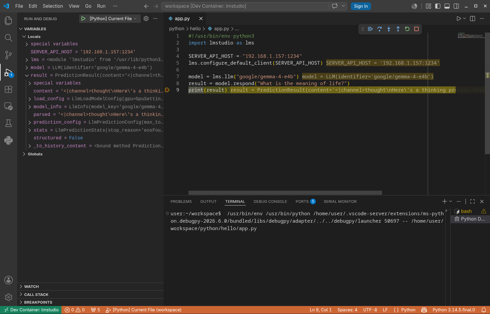

### Web application (spell checker)

With the basics in place it is time to make a more useful application.

The idea is shown below. The user types in a text that should be checked, and then click the "Spell Check & Correct" button. The output is printed in the bottom.

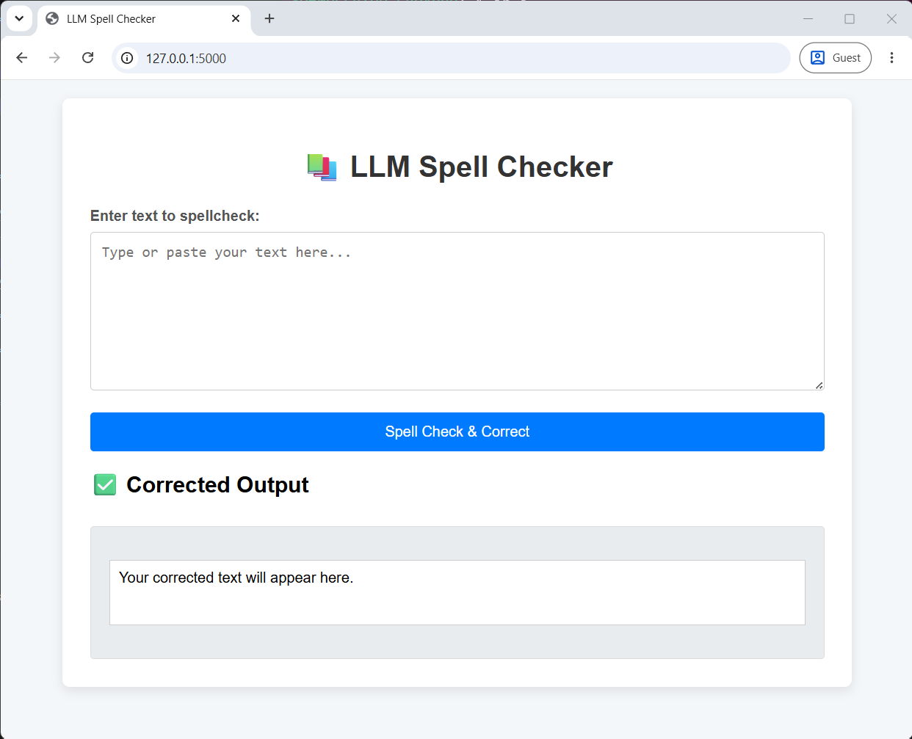

The best way to control the output might be with a certain agent and instruction files to make sure the output is formatted in a specific way.

However for simplicity we will just use a very naive scheme where we prepend a certain behavior to the prompt.

This is given in `python/spellcheck/app.py` where we make the following prompt:

```python
# Crafting the prompt for the LLM to act as a spell checker
prompt = f"""You are an expert spell-checker and grammar corrector. Your task is to review the following text and correct all spelling mistakes, grammatical errors, and improve clarity while maintaining the original meaning. Only return the corrected text, nothing else.

Original Text: "{text_to_check}"

You must output all after the Corrected Text: and nothing else
```

So the user input `text_to_check` has a pre- and postamble.

Since we state that the corrected output must be after the `Corrected Text:` identifier, we can simply strip the response to be everything after this sub string. Of course it is very inefficient and has the risk of cutting away parts of the output message that is actual response (if it should container more `Corrected Text:` sections)

```python
result = model.respond(prompt)
corrected_text = result.parsed.split("Corrected Text:")[-1].strip()
return jsonify({"success": True, "corrected_text": corrected_text})
```

The frontend is also very simple. When the user clicks the button, it triggers the `spellCheckText()` javascript function. It will POST to the `/spellcheck` endpoint and async await the response.

```javascript
async function spellCheckText() {
    ...
    const inputText = document.getElementById('inputText').value;
    ...
    try {
        const response = await fetch('/spellcheck', {
            method: 'POST',
            headers: {
                'Content-Type': 'application/json'
            },
            body: JSON.stringify({ text: inputText })
        });

        const data = await response.json();

        if (data.success) {
            outputElement.textContent = data.corrected_text;
        } else {
            outputElement.textContent = `Error: ${data.error || 'Unknown error occurred.'}`;
        }
    ...
}
```

A demo of the final result is shown below


### devcontainer

To make a unified development environment in VS Code the supplied `.devcontainer` and `.vscode` setup can be used.

Check docs: https://code.visualstudio.com/docs/devcontainers/containers

## Bash (REST API)

An alternative to the Python SDK is just to use the plain REST API also provided with LM Studio.

REST API's have the benefit of not relying on any intermediate library, and is a very common interface that can be used in almost all applications.

This makes it possible to embed agentic behavior directly into our terminal.

First lets see how we can communicate with the REST API. For this we use good old `curl`.

> **NOTE!** If you want to use proper authentication for your session it is possible to do so with an auth header `Authorization: Bearer $LM_API_TOKEN`, where `LM_API_TOKEN` is a token defined in the LM Studio setup.
> 
> More info can be found here: https://lmstudio.ai/docs/developer/core/authentication.
> 
> In this guide we will skip it.

We can check connection by listing available models with the `api/v1/models` endpoint

    curl http://192.168.1.157:1234/api/v1/models

This will output something like

    {
        "models": [
            {
                "type": "llm",
                "publisher": "google",
                "key": "google/gemma-4-e4b",
                "display_name": "Gemma 4 E4B",
                "architecture": "gemma4",
                ...
            }
        ]
    }

We can now initiate a chat prompt with the `api/v1/chat` endpoint. Here we will ask what `10 + 20` is

    curl http://192.168.1.157:1234/api/v1/chat \
        -s -H "Content-Type: application/json" \
        -d '{
            "model": "google/gemma-4-e4b",
            "input": "Can you tell me what 10+20 is?",
            "context_length": 60000,
            "temperature": 0
        }'

This will return a long json object.

    {
        "model_instance_id": "google/gemma-4-e4b",
        "output": [
            {
                "type": "reasoning",
                "content": "\nThinking Process:\n\n1.  **Analyze the Request:** The user is asking for the sum of \"10 + 20\".\n2.  **Perform Calculation:** 10 + 20 = 30.\n3.  **Formulate the Answer:** State the result clearly. (Self-Correction/Refinement: Keep it simple and direct.)"
            },
            {
                "type": "message",
                "content": "10 + 20 is **30**."
            }
        ],
        "stats": {
            "input_tokens": 29,
            "total_output_tokens": 93,
            "reasoning_output_tokens": 78,
            "tokens_per_second": 86.86904351578634,
            "time_to_first_token_seconds": 0.451
        },
        "response_id": "resp_56186e0cf01e8bbcc3fb164943cb8f55d97506019804ce69"
    }

We can pipe the output to `jq` to filter the answer. 

    curl http://192.168.1.157:1234/api/v1/chat \
        -s -H "Content-Type: application/json" \
        -d '{
            "model": "google/gemma-4-e4b",
            "input": "Can you tell me what 10+20 is?",
            "context_length": 60000,
            "temperature": 0
        }' | jq '.output[] | select(.type == "message") | .content'

And the response is just

    "10 + 20 is **30**."

To really make it usefull we can make a bash function called `agent` where all arguments are added as input.

    agent() {
        local input="$@"

        curl http://192.168.1.157:1234/api/v1/chat \
            -s -H "Content-Type: application/json" \
            -d "{
                \"model\": \"google/gemma-4-e4b\",
                \"input\": \"$input\",
                \"context_length\": 8000,
                \"temperature\": 0
            }" |
        jq '.output[] | select(.type == "message") | .content'
    }

Now we have real agentic behavior in the prompt

    agent "Can you tell me what 10+20 is?"
    "10 + 20 is **30**."


## Energy consumption (cost)

A final aspect of self-hosting is the cost. Initially you have the cost of requiring and setting up the hardware.

After that the only cost is the energy.

Below are some power measurements done on the hardware used in the guide, and what the cost looks like at different usage levels. The power is measured on the 230V inlet to the PC.

| #   | Scenario            | Power (W) |
| --- | ------------------- | --------- |
| 1.  | No work (baseline)  | 150       |
| 2.  | GPU full load (GUI) | 530       |
| 3.  | GPU full load (CLI) | 480       |

To make a small benchmark we ask the AI to do the following prompt

```
Can you make an old-school text based dungeon crawler as a small web application. It should just use vanilla html, css and js. It should have a playtime of 10 mins. Files must be placed in the game folder.
```

Conditions during measurements:
* Model = `google/gemma-4-e4b` 
* Power rates (DKK) = 4 DKK/kWh
* Exchange rate (DKK:USD) = 6.5:1 ==> 0.154 USD/DKK
* Power rates (USD) = 4 * 0.154 = 0.615 USD/kWh
* Claude Haiku 4.5 [pricing](https://platform.claude.com/docs/en/about-claude/pricing) = input tokens: $1/1M , output tokens: $5/1M

| Setup  | Token count | Time            | Energy (kWh)          | Cost in USD (LM Studio) | Cost in USD (Claude Haiku 4.5)  |
| ------ | ----------- | --------------- | --------------------- | ----------------------- | ------------------------------- |
| 2. GUI | 26k         | 2m 7s (~0.035h) | 0.530 * 0.035 = 0.019 | 0.019 * 0.615 = $0.01   | input = $0.026, output = $0.130 |
| 3. CLI | 32k         | 4m 5s (~0.07h)  | 0.480 * 0.07 = 0.034  | 0.034 * 0.615 = $0.02   | input = $0.032, output = $0.160 |

Just looking to the numbers the self-hosting is cheaper in cost per token. Here we are comparing a low-tier model from Anthropic. Of course there are other parameters to consider - like quality of the delivered output and speed.